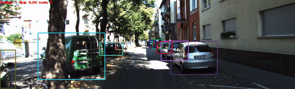

# DEFT

DEFT: Detection Embeddings for Tracking


Contact: [chaabane@colostate.edu](mailto:chaabane@colostate.edu). Any questions or discussion are welcome! 

## Abstract
Most modern multiple object tracking (MOT) systems follow the tracking-by-detection paradigm, consisting of a detector followed by a method for associating detections into tracks. There is a long history in tracking of combining motion and appearance features to provide robustness to occlusions and other challenges, but typically this comes with the trade-off of a more complex and slower implementation. Recent successes on popular 2D tracking benchmarks indicate that top-scores can be achieved using a state-of-the-art detector and relatively simple associations relying on single-frame spatial offsets -- notably outperforming contemporary methods that leverage learned appearance features to help re-identify lost tracks. In this paper, we propose an efficient joint detection and tracking model named DEFT, or Detection Embeddings for Tracking. Our approach relies on an appearance-based object matching network jointly-learned with an underlying object detection network. An LSTM is also added to capture motion constraints. DEFT has comparable accuracy and speed to the top methods on 2D online tracking leaderboards while having significant advantages in robustness when applied to more challenging tracking data. DEFT raises the bar on the nuScenes monocular 3D tracking challenge, more than doubling the performance of the previous top method.
### Video examples on benchmarks test sets
   
   
   
   
   

## Installation
* Clone this repo, and run the following commands.
* create a new conda environment and activate the environment.
```
git clone git@github.com:MedChaabane/DEFT.git
cd DEFT
conda create -y -n DEFT python=3.7
conda activate DEFT
```
* Install PyTorch and the dependencies.
```
conda install -y pytorch==1.2.0 torchvision==0.4.0 cudatoolkit=10.0 -c pytorch
pip install -r requirements.txt  
```
* Install [COCOAPI](https://github.com/cocodataset/cocoapi):
```
pip install cython; pip install -U 'git+https://github.com/cocodataset/cocoapi.git#subdirectory=PythonAPI'
```
* Compile [DCNv2](https://github.com/CharlesShang/DCNv2)
```
cd src/lib/model/networks/
git clone https://github.com/CharlesShang/DCNv2
cd DCNv2
./make.sh
```
* Download the [pretrained models](https://drive.google.com/drive/folders/1dlVoV-4fMYlttdj2ba0unn6WX-nxaC48?usp=sharing) and move them to src/models/ . 

## Tracking performance
### Results on MOT challenge test set 
| Dataset    |  MOTA | MOTP | IDF1 | IDS |
|--------------|-----------|--------|-------|--------|
|MOT16 (Public)    | 61.7 | 78.3 | 60.2 | 768 | 
|MOT16 (Private)       | 68.03 | 78.71 | 66.39 | 925 | 
|MOT17 (Public)    | 60.4 | 78.1 | 59.7 | 2581 |
|MOT17 (Private)       | 66.6 | 78.83 | 65.42 | 2823 | 

The results are obtained on the [MOT challenge](https://motchallenge.net) evaluation server.

### Results on 2D Vehicle Tracking on KITTI test set
| Dataset    |  MOTA | MOTP | MT | ML |IDS|
|--------------|-----------|--------|-------|--------|--------|
|KITTI    | 88.95 | 84.55 | 84.77 | 1.85 | 343|

Tthe results are obtained on the [KITTI challenge](http://www.cvlibs.net/datasets/kitti/eval_tracking.php) evaluation server.

### Results on 3D Tracking on nuScenes test set
| Dataset    |  AMOTA | MOTAR | MOTA |
|--------------|-----------|--------|-------|
|nuScenes    | 17.7 | 48.4 | 15.6 | 

Tthe results are obtained on the [nuSCenes challenge](https://www.nuscenes.org/tracking?externalData=no&mapData=no&modalities=Camera) evaluation server.

## Datsets Preparation
We use similar datasets preparation like in [CenterTrack framework](https://github.com/xingyizhou/CenterTrack/)
###  MOT 2017 
- Run the dataset preprocessing script.
```
cd src/tools/
sh get_mot_17.sh
```
- The output data structure should be:
```
  ${DEFT_ROOT}
  |-- data
  `-- |-- mot17
      `-- |--- train
          |   |--- MOT17-02-FRCNN
          |   |    |--- img1
          |   |    |--- gt
          |   |    |   |--- gt.txt
          |   |    |   |--- gt_train_half.txt
          |   |    |   |--- gt_val_half.txt
          |   |    |--- det
          |   |    |   |--- det.txt
          |   |    |   |--- det_train_half.txt
          |   |    |   |--- det_val_half.txt
          |   |--- ...
          |--- test
          |   |--- MOT17-01-FRCNN
          |---|--- ...
          `---| annotations
              |--- train_half.json
              |--- val_half.json
              |--- train.json
              `--- test.json
```
  ###  KITTI Tracking
- Download [images](http://www.cvlibs.net/download.php?file=data_tracking_image_2.zip), [annotations](http://www.cvlibs.net/download.php?file=data_tracking_label_2.zip), and [calibration information](http://www.cvlibs.net/download.php?file=data_tracking_calib.zip) from [KITTI Tracking website](http://www.cvlibs.net/datasets/kitti/eval_tracking.php) and unzip. Place or symlink the data as below:
  
```
  ${DEFT_ROOT}
  |-- data
  `-- |-- kitti_tracking
      `-- |-- data_tracking_image_2
          |   |-- training
          |   |-- |-- image_02
          |   |-- |-- |-- 0000
          |   |-- |-- |-- ...
          |-- |-- testing
          |-- label_02
          |   |-- 0000.txt
          |   |-- ...
          `-- data_tracking_calib
```
  
- Run the dataset preprocessing script.
```
cd src/tools/
sh get_kitti_tracking.sh
```

- The resulting data structure should look like:

```
  ${DEFT_ROOT}
  |-- data
  `-- |-- kitti_tracking
      `-- |-- data_tracking_image_2
          |   |-- training
          |   |   |-- image_02
          |   |   |   |-- 0000
          |   |   |   |-- ...
          |-- |-- testing
          |-- label_02
          |   |-- 0000.txt
          |   |-- ...
          |-- data_tracking_calib
          |-- label_02_val_half
          |   |-- 0000.txt
          |   |-- ...
          |-- label_02_train_half
          |   |-- 0000.txt
          |   |-- ...
          `-- annotations
              |-- tracking_train.json
              |-- tracking_test.json
              |-- tracking_train_half.json
              `-- tracking_val_half.json
```
  
###  nuScenes Tracking 
- Download the dataset from [nuScenes website](https://www.nuscenes.org/download). You only need to download the "Keyframe blobs", and only need the images data. You also need to download the maps and all metadata.
- Unzip, rename, and place  the data as below. You will need to merge folders from different zip files.
```
 ${DEFT_ROOT}
  |-- data
  `-- |-- nuscenes
      `-- |-- v1.0-trainval
          |   |-- samples
          |   |   |-- CAM_BACK
          |   |   |   | -- xxx.jpg
          |   |   |-- CAM_BACK_LEFT
          |   |   |-- CAM_BACK_RIGHT
          |   |   |-- CAM_FRONT
          |   |   |-- CAM_FRONT_LEFT
          |   |   |-- CAM_FRONT_RIGHT
          |-- |-- maps
          `-- |-- v1.0-trainval_meta
```
- Run the dataset preprocessing script.
```
cd src/tools/
convert_nuScenes.py
```


## References
Please cite the corresponding References if you use the datasets.

~~~
  @article{MOT16,
    title = {{MOT}16: {A} Benchmark for Multi-Object Tracking},
    shorttitle = {MOT16},
    url = {http://arxiv.org/abs/1603.00831},
    journal = {arXiv:1603.00831 [cs]},
    author = {Milan, A. and Leal-Taix\'{e}, L. and Reid, I. and Roth, S. and Schindler, K.},
    month = mar,
    year = {2016},
    note = {arXiv: 1603.00831},
    keywords = {Computer Science - Computer Vision and Pattern Recognition}
  }


  @INPROCEEDINGS{Geiger2012CVPR,
    author = {Andreas Geiger and Philip Lenz and Raquel Urtasun},
    title = {Are we ready for Autonomous Driving? The KITTI Vision Benchmark Suite},
    booktitle = {CVPR},
    year = {2012}
  }


  @inproceedings{nuscenes2019,
  title={{nuScenes}: A multimodal dataset for autonomous driving},
  author={Holger Caesar and Varun Bankiti and Alex H. Lang and Sourabh Vora and Venice Erin Liong and Qiang Xu and Anush Krishnan and Yu Pan and Giancarlo Baldan and Oscar Beijbom},
  booktitle={CVPR},
  year={2020}
  }
~~~
## Training and Evaluation Experiments
Scripts for training and evaluating DEFT on MOT, KITTI and nuScenes are available in the [experiments](https://github.com/MedChaabane/DEFT/tree/main/experiments) folder. The outputs videos and results (same as submission format) will be on the folders $dataset_name$_videos and $dataset_name$_results. 
## Acknowledgement
A large portion of code is borrowed from [xingyizhou/CenterTrack](https://github.com/xingyizhou/CenterTracktoward), [shijieS/SST](https://github.com/shijieS/SST) and [Zhongdao/Towards-Realtime-MOT](https://github.com/Zhongdao/Towards-Realtime-MOT/tree/master/tracker), many thanks to their wonderful work!
